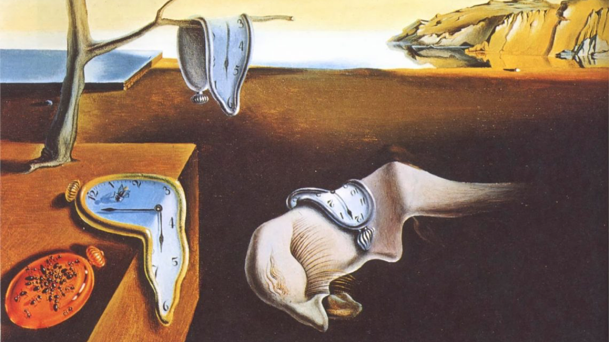
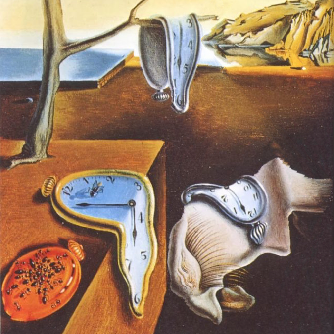

# Seam carving

This is an implementation of the [seam carving] algorithm using the [Sobel operator] as the energy function.

[seam carving]: https://en.wikipedia.org/wiki/Seam_carving
[Sobel operator]: https://en.wikipedia.org/wiki/Sobel_operator

| Original                             | Output                                      |
|:------------------------------------:|:-------------------------------------------:|
|  |  |
